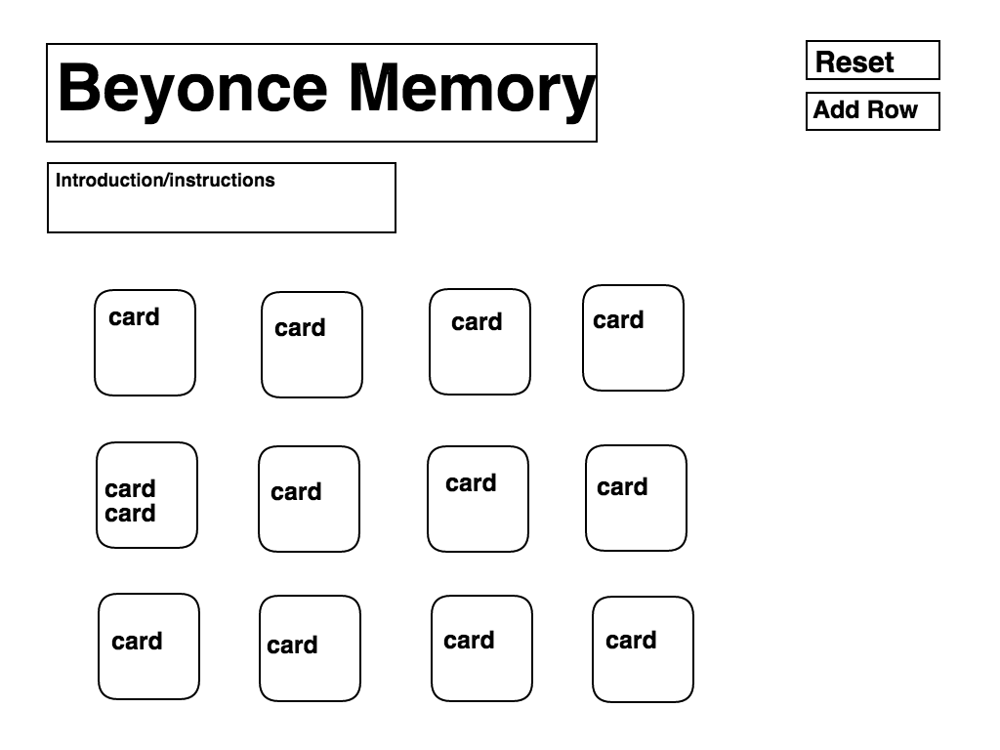

# beyonce_memory

###**User Stories:** 
Here's how concentration (aka memory) works: It's usually a single-player game -- good for only children and introverts -- modeled after a card game. In this application, the solo player, or user, will be able to select two "cards" per turn, by clicking on them. The cards are represented by square boxes within a grid. Upon clicking, the cards will be "flipped over" to reveal the images hidden underneath. If the cards are a match, they both remain visible. If they don't, both cards are turned back over. The game ends when all the pairs have been uncovered.  

###**Front-end Wireframes:** 

###**List of technologies used:** 
- HTML  
- CSS  
- Javascript  
- Underscore.js (courtesy of https://github.com/jashkenas/underscore)

###**Description of your app:** 
Beyoncentration is a memory game, using gifs instead of static images. The gifs are randomly sampled from a list and then assigned to the boxes on the grid, so every game is different. It is meant to be scalable, so the user can add rows to the bottom of the "board" to make it harder.  

###**Link to your playable app deployed on Github Pages:** 
Play it [here](http://francesharlow.github.io/beyonce-memory/).

